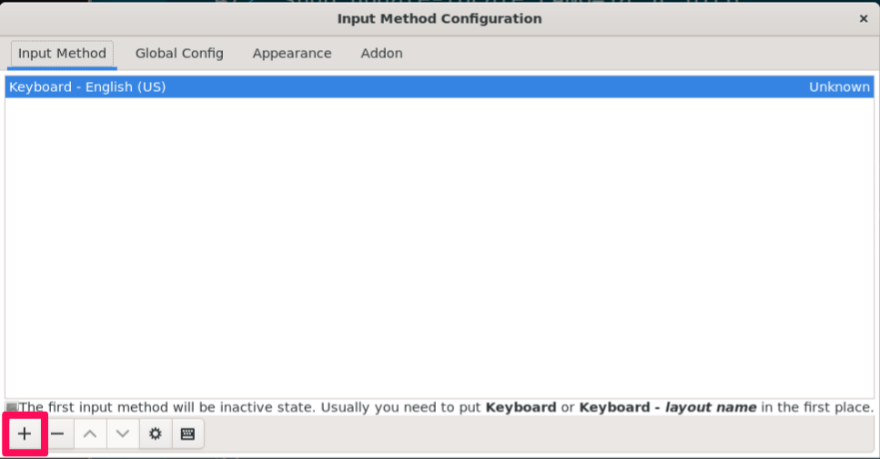

# WSL2にインストールしたUbuntuの初期設定

---
[toc]
---

## WindowsのマイドキュメントフォルダをWSL2のホームディレクトにマウントする

WSL2のUbuntuからWindowsのマイドキュメントフォルダへは
`/mnt/c/Users/ユーザ名/Documents`からアクセスできますが，
簡単にアクセスするためにWindowsのマイドキュメントフォルダの
シンボリックリンクをUbuntuのホームディレクトリ以下に張ります．

手順は以下になります．

1. スタートメニューからUbuntuを起動する．
1. WindowsホームディレクトリのシンボリックリンクをUbuntuに張る（ユーザ名の部分は自分のWindowsユーザー名に置き換えること）．
   
```sh
cd ~
ln -s /mnt/c/Users/ユーザ名/Documents/ Documents
ln -s /mnt/c/Users/ユーザ名/Downloads/ Downloads
```

これでUbuntuの`~/Documents`にWindowsのマイドキュメントフォルダが，`~/Download`に
Windowsのダウンロードフォルダに紐付けられます．

## プロンプトに表示されるパスを短くする

``` sh
cat << 'EOS' | tee -a ~/.bashrc
export PROMPT_DIRTRIM=1
alias ls='ls -GF'
EOS
```

## インストール済みパッケージのアップデート

WSL2にインストールしたUbuntuのシステムをアップデートします．
これはaptコマンドでインストールしたアプリケーションのアップデートになります．セキュリティ対策のためにも週に1回程度はアップデートをした方がよいでしょう．初回のアップデートには時間がかかることがあります．

```sh
sudo apt update && sudo apt upgrade -y
```

sudoコマンドを実行すると管理者パスワードの入力が必要になります．
Ubuntuをインストール際に入力した管理者パスワードを入力してください．

## 日本語表示と入力ができるようにする

コンソールでの日本語表示はできますが，UbuntuのGUIソフトウエアでの日本語表示と日本語入力のための設定を行います．
まずは必要最低限の日本語フォント（notoフォント）をUbuntuにインストールします．

```sh
sudo apt install -y fonts-noto
```

### 日本語入力システムのインストール

日本語変換プログラムmozcをインストールします．
GUIソフトウエアでの日本語入力に必要です．

```sh
sudo apt install -y fcitx-mozc
```

次にUbuntuを再起動します．
まず`exit`コマンドでターミナルを終了します．

```sh
exit
```

ターミナルを終了したら，スタートメニューを右クリックしてターミナル（管理者）を起動します．

  

プロンプトに以下のコマンドを入力し，WSLをシャットダウンします．

```sh
wsl --shutdown
```

シャットダウンが終了したら，再度スタートメニューからUbuntuを起動します．

Ubuntuが起動したら日本語変換システムの設定を行います．

```sh
fcitx > /dev/null 2>&1
im-config -n fcitx
```

次に日本語変換システムを登録します．

```sh
fcitx-config-gtk3 > /dev/null 2>&1
```

上記コマンドを実行すると以下のようなウインドウが表示されます．

  

左下の`+`ボタンを押します．

  

`Add input method`ウインドウが出てくるので，
`Only Show Current Language`のチェックを外してその下のテキスト入力エリアに`mozc`と入力します．
上部の入力メソッド一覧に`Mozc`が表示されるのでそれを選択しOKボタンを押します．

  

`Imput Method`に`Mozc`が追加されたのを確認して右上の`X`ボタンを押して設定を終了します．

次に日本語入力システムの起動設定を行います．
以下をターミナルに貼り付けて実行します．

```sh
cat << 'EOS' | tee -a ~/.bashrc
export GTK_IM_MODULE=fcitx
export QT_IM_MODULE=fcitx
export XMODIFIERS="@im=fcitx"
export DefaultIMModule=fcitx
fcitx-autostart > /dev/null 2>&1
EOS
```

実行後に`exit`コマンドでターミナルを終了し，
再びスタートメニューからUbuntuを起動します．
これでGUIソフトウエア上で日本語入力ができるようになります．

```sh
exit
```

試しにUbuntuのGUIソフトウエアをインストールしてみましょう．
テキストエディタのplumaをインストールします．

```sh
sudo apt install -y pluma
```

インストールが終了したらplumaを起動します．

```sh
pluma&
```

plumaが起動すると思います．
`Ctrl+スペース`でmozcを起動し，ローマ字で日本語を入力してください．
日本語入力を確認できたら，plumaを終了します．

### 日本語ロケールの設定

ターミナルのメッセージなどが英語で表示されていますが，
以下を実行すれば日本語で表示されるようになります．
これは必須ではないので，お好みで設定してください．

```sh
sudo apt -y install language-pack-ja
sudo update-locale LANG=ja_JP.UTF8
```

実行後はターミナルを再起動します．
