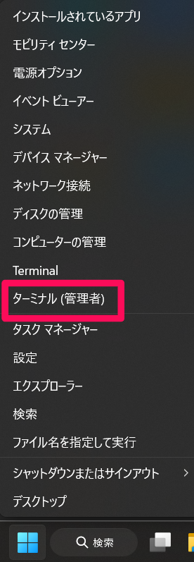
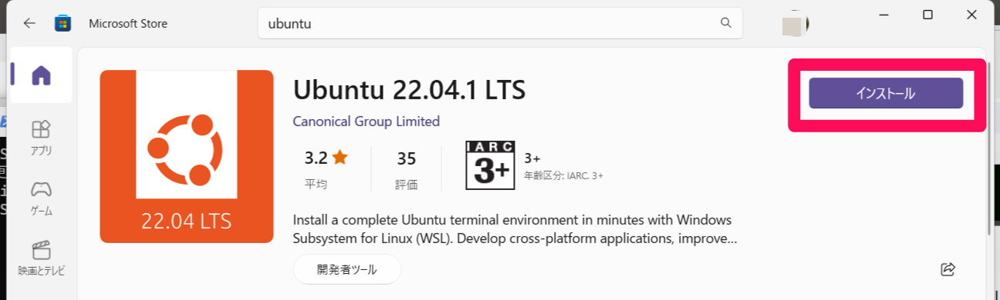

# WindowsへのWSL2とUbuntuのインストール方法

[toc]

## Windowsで仮想マシンを動かすための準備

* スタートメニューからコントロールパネルを検索して実行します．
  

* プログラムを押します．

  

* Windowsの機能の有効化または無効化を押します．

  

* 仮想マシンプラットフォームとLinux用Windowsサブシステムにチェックを入れます（最初からチェックが入っている場合もあります）．

  

  


* OKを押すと再起動を促されるのでPCを再起動します（再起動しない場合もあります）．


## WSL2のインストール及びアップデート

* スタートメニューを右クリックし，ターミナル（管理者）を起動します．

  


* プロンプトに以下のコマンドを入力します．

```wsl --set-default-version 2```

  

* 「この操作を正しく終了しました。」と表示されたら次に進みます．

* プロンプトに以下のコマンドを入力します．
```wsl --update```

  

* 「Linux 用 Windows サブシステム はインストールされました。」と表示されたらターミナルを閉じます．


## WSL2用Ubuntuのインストール

* Microsoft Storeを開き，「ubuntu」を検索します．
* Ubuntu 22.04.1 LTSを開く（Ubuntuはいくつかありますが，バージョンナンバーがついているものを選んでください）．

  


* インストールボタンを押してUbuntu 22.04.1 LTSをインストールします．

  

* スタートメニューからUbuntu 22.04.1 LTSを起動します．

  

* ユーザー名の入力を求められるので，好きなユーザー名を入力します．__ユーザー名は半角アルファベットを使うこと．またスペースは使えません．このユーザー名がWSL2上のUbuntuの管理者ユーザー名（ログイン名）になリます．__

  

* パスワードを設定します．パスワードは自由ですが __このパスワードはWSL2上のUbuntuの管理者ユーザーのパスワードになるため，Ubuntuシステムのアップデート．や管理・アプリのインストール時に必要になります．また入力しているパスワードは表示されないので注意してください．__
* 入力したパスワードがわからなくなってしまったら，とりあえずエンターを押してパ次のスワードの再確認に進んでください．パスワードの再確認でエンターのみを押せば再度パスワードの設定になります．
* パスワードの確認のため，パスワードの入力が再度求められます．
* PCの再起動を求められたら指示に従ってPCを再起動します．

  

* 再起動後にスタートメニューからUbuntu 22.04.1 LTSを起動します．
* 再起動しなくても以下のようなメッセージが出たらWSL2とUbuntu22.04.1 LTSのインストールは完了です．

  

# WSL2にインストールしたUbuntuのアンインストール方法

設定ミスなどでUbuntuの動作がおかしくなってしまったときなどは
Ubuntuをばっさり初期化した方が良いかもしれません．
WSL2上のUbuntuはWindowsからは切り離されたシステムなので，
Ubuntuを初期化してもWindowsへの影響はありません．
Ubuntuの初期化は以下になります．

* スタートメニューを右クリックし，ターミナルを開く．
* 以下のコマンドでwsl2を終了する．

```
wsl --shutdown
```

* WSLにインストールされているUbuntuを解除する．

```
wsl --unregister Ubuntu-22.04
```

これでUbuntuを初期化できました．
念のためPCを再起動しスタートメニューからUbuntuを起動すれば，
ユーザー名の設定に戻ります．
