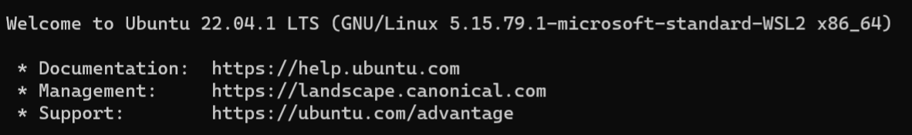

# WindowsへのWSL2とUbuntuのインストール方法

## windowsで仮想マシンを動かすための準備をする

* スタートメニューからコントロールパネルを検索して実行する．
  

* プログラムを押す．

  
* Windowsの機能の有効化または無効化を押す．

  

* 仮想マシンプラットフォームとLinux用Windowsサブシステムにチェックを入れる（最初からチェックが入っている場合もあります）．

  

  


* OKを押すと再起動を促されるのでPCを再起動する（再起動しない場合もあります）．


## WSL2のインストール及びアップデート

* スタートメニューを右クリックし，ターミナル（管理者）を起動する．

  


* プロンプトに以下のコマンドを入力する．

```wsl --set-default-version 2```

  

* 「この操作を正しく終了しました。」と表示されたら次に進む．


* プロンプトに以下のコマンドを入力する．

```wsl --update```

  

* 「Linux 用 Windows サブシステム はインストールされました。」と表示されたら次に進む．


## WSL2用Ubuntuのインストール

* Microsoft Storeを開き，「ubuntu」を検索する．
* Ubuntu 22.04.1 LTSを開く．

  


* インストールボタンを押してUbuntu 22.04.1 LTSをインストールする．

  


* スタートメニューからUbuntu 22.04.1 LTSを起動する．

  

* ユーザー名の入力を求められるので，好きなユーザー名を入力する．__ユーザー名は半角アルファベットを使うこと．スペースは使えない．このユーザー名がWSL2上のUbuntuの管理者ユーザー名（ログイン名）になる．__

  

* パスワードを設定する．パスワードは自由だが __このパスワードはWSL2上のUbuntuの管理者ユーザーのパスワードになるため，Ubuntuシステムのアップデートや管理・アプリのインストール時に必要になる．忘れないようにすること．__
* パスワードの確認のため，パスワードの入力が再度求められる．
* PCの再起動を求められたら指示に従ってPCを再起動する．

  


* 再起動後にスタートメニューからUbuntu 22.04.1 LTSを起動する．
* 再起動しなくても以下のようなメッセージが出たらWSL2とUbuntu22.04.1 LTSのインストールは完了．

  


# WSL2にインストールしたUbuntuのアンインストール方法

設定ミスなどでUbuntuの動作がおかしくなってしまったときなどは，
Ubuntuをばっさりアンインストールして再インストールした方が良いかもしれません．
WSL2上のUbuntuはWindowsからは切り離されたシステムなので，
UbuntuをアンインストールしてもWindowsへの影響はありません．

* アンインストール方法
* スタートメニューの設定・アプリからUbuntu 22.04.1 LTSを選んでアンインストールする．
* UbuntuをアンインストールしてもWSL2は残っているので，Microsoft Storeから再インストールできます．